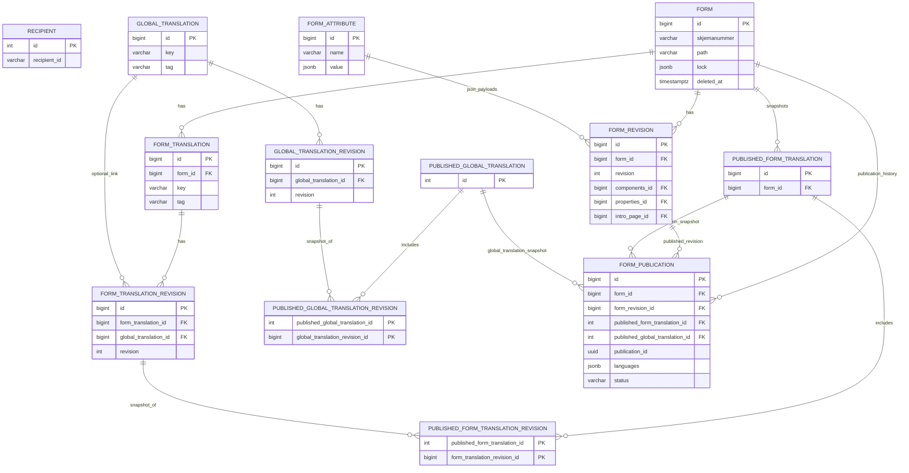
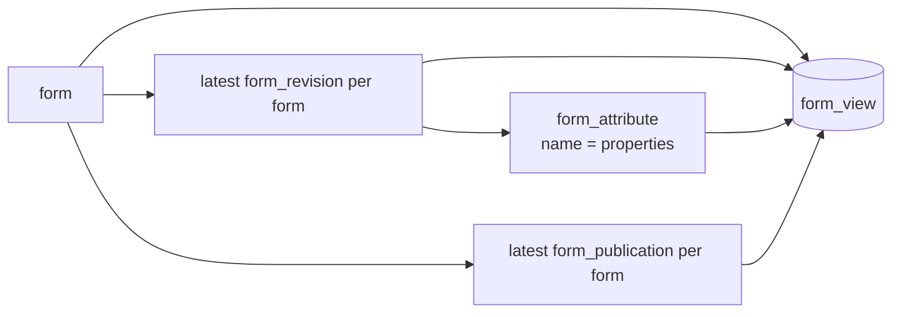

# Database schema

This service uses **PostgreSQL** and manages schema changes with **Flyway** migrations in `src/main/resources/db/migration`.
The schema centers around forms, versioned revisions, translations, and publication snapshots.

## High-level ER diagram

## `form_view` read model

`form_view` is a database view, not a table. It denormalizes the latest revision and latest publication per form for read-heavy queries.

## Table reference

### `recipient`

| Column | Type | Notes |
| --- | --- | --- |
| `id` | `integer` | Primary key, identity |
| `recipient_id` | `varchar(36)` | Unique, not null |
| `name` | `varchar(128)` | Not null |
| `po_box_address` | `varchar(128)` | Not null |
| `postal_code` | `varchar(4)` | Not null |
| `postal_name` | `varchar(64)` | Not null |
| `created_at` | `timestamptz` | Not null, default UTC timestamp |
| `created_by` | `varchar(128)` | Not null |
| `changed_at` | `timestamptz` | Not null, default UTC timestamp |
| `changed_by` | `varchar(128)` | Not null |

### `form`

| Column | Type | Notes |
| --- | --- | --- |
| `id` | `bigint` | Primary key, identity |
| `skjemanummer` | `varchar(24)` | Unique, nullable in DB |
| `path` | `varchar(24)` | Unique, nullable in DB |
| `created_at` | `timestamptz` | Not null, default UTC timestamp |
| `created_by` | `varchar(128)` | Not null |
| `deleted_at` | `timestamptz` | Soft-delete timestamp |
| `deleted_by` | `varchar(128)` | Soft-delete actor |
| `lock` | `jsonb` | Optional lock payload |

### `form_attribute`

Shared JSONB storage for revision payloads.

| Column | Type | Notes |
| --- | --- | --- |
| `id` | `bigint` | Primary key, identity |
| `name` | `varchar(16)` | Not null, indexed; values used in code: `components`, `properties`, `introPage` |
| `value` | `jsonb` | Not null |

### `form_revision`

| Column | Type | Notes |
| --- | --- | --- |
| `id` | `bigint` | Primary key, identity |
| `form_id` | `bigint` | Not null, FK -> `form.id` |
| `revision` | `int` | Not null, unique with `form_id` |
| `title` | `varchar(256)` | Not null |
| `created_at` | `timestamptz` | Not null, default UTC timestamp |
| `created_by` | `varchar(128)` | Not null |
| `components_id` | `bigint` | Not null, FK -> `form_attribute.id` |
| `properties_id` | `bigint` | Not null, FK -> `form_attribute.id` |
| `intro_page_id` | `bigint` | Nullable, FK -> `form_attribute.id` |

### `global_translation`

| Column | Type | Notes |
| --- | --- | --- |
| `id` | `bigint` | Primary key, identity |
| `key` | `varchar(1024)` | Unique, not null |
| `tag` | `varchar(16)` | Not null |
| `deleted_at` | `timestamptz` | Soft-delete timestamp |
| `deleted_by` | `varchar(128)` | Soft-delete actor |

### `global_translation_revision`

| Column | Type | Notes |
| --- | --- | --- |
| `id` | `bigint` | Primary key, identity |
| `global_translation_id` | `bigint` | Not null, FK -> `global_translation.id` |
| `revision` | `int` | Not null, unique with `global_translation_id` |
| `nb` | `varchar(1024)` | Bokmal value |
| `nn` | `varchar(1024)` | Nynorsk value |
| `en` | `varchar(1024)` | English value |
| `created_at` | `timestamptz` | Not null, default UTC timestamp |
| `created_by` | `varchar(128)` | Not null |

### `published_global_translation`

Snapshot header for a published set of global translations.

| Column | Type | Notes |
| --- | --- | --- |
| `id` | `int` | Primary key, identity |
| `created_at` | `timestamptz` | Not null, default UTC timestamp |
| `created_by` | `varchar(128)` | Not null |

### `published_global_translation_revision`

Join table between a publication snapshot and the included global translation revisions.

| Column | Type | Notes |
| --- | --- | --- |
| `published_global_translation_id` | `int` | PK, FK -> `published_global_translation.id` |
| `global_translation_revision_id` | `bigint` | PK, FK -> `global_translation_revision.id` |

### `form_translation`

| Column | Type | Notes |
| --- | --- | --- |
| `id` | `bigint` | Primary key, identity |
| `form_id` | `bigint` | Not null, FK -> `form.id` |
| `key` | `varchar(5120)` | Not null, unique with `form_id` |
| `tag` | `varchar(16)` | Not null, default `'standard'` |
| `deleted_at` | `timestamptz` | Soft-delete timestamp |
| `deleted_by` | `varchar(128)` | Soft-delete actor |

### `form_translation_revision`

| Column | Type | Notes |
| --- | --- | --- |
| `id` | `bigint` | Primary key, identity |
| `form_translation_id` | `bigint` | Not null, FK -> `form_translation.id` |
| `revision` | `int` | Not null, unique with `form_translation_id` |
| `global_translation_id` | `bigint` | Nullable, FK -> `global_translation.id` |
| `nb` | `varchar(5120)` | Inline Bokmal text |
| `nn` | `varchar(5120)` | Inline Nynorsk text |
| `en` | `varchar(5120)` | Inline English text |
| `created_at` | `timestamptz` | Not null, default UTC timestamp |
| `created_by` | `varchar(128)` | Not null |

### `published_form_translation`

Snapshot header for a published set of form translations for one form.

| Column | Type | Notes |
| --- | --- | --- |
| `id` | `bigint` | Primary key, identity |
| `form_id` | `bigint` | Not null, FK -> `form.id` |
| `created_at` | `timestamptz` | Not null, default UTC timestamp |
| `created_by` | `varchar(128)` | Not null |

### `published_form_translation_revision`

Join table between a published form-translation snapshot and the included revisions.

| Column | Type | Notes |
| --- | --- | --- |
| `published_form_translation_id` | `int` | PK, FK -> `published_form_translation.id` |
| `form_translation_revision_id` | `bigint` | PK, FK -> `form_translation_revision.id` |

### `form_publication`

Publication history for forms. Each row points at the exact form revision and translation snapshots that were published.

| Column | Type | Notes |
| --- | --- | --- |
| `id` | `bigint` | Primary key, identity |
| `form_id` | `bigint` | Not null, FK -> `form.id` |
| `form_revision_id` | `bigint` | Not null, FK -> `form_revision.id` |
| `published_form_translation_id` | `int` | Not null, FK -> `published_form_translation.id` |
| `published_global_translation_id` | `int` | Not null, FK -> `published_global_translation.id` |
| `languages` | `jsonb` | Not null, default `["nb"]` |
| `status` | `varchar(16)` | Not null, default `'published'`; values in code: `published`, `unpublished` |
| `created_at` | `timestamptz` | Not null, default UTC timestamp |
| `created_by` | `varchar(128)` | Not null |
| `publication_id` | `uuid` | Not null, unique, default `uuidv7()` |

### `form_view` (view)

Read-only projection used by the application to load the current form state quickly.

| Column | Type | Notes |
| --- | --- | --- |
| `id` | `bigint` | Form id |
| `path` | `varchar(24)` | Form path |
| `skjemanummer` | `varchar(24)` | Form number |
| `lock` | `jsonb` | Current form lock |
| `deleted_at` | `timestamptz` | Soft-delete timestamp |
| `deleted_by` | `varchar(128)` | Soft-delete actor |
| `changed_at` | `timestamptz` | From latest `form_revision.created_at` |
| `changed_by` | `varchar(128)` | From latest `form_revision.created_by` |
| `revision` | `int` | Latest revision number |
| `title` | `varchar(256)` | Latest revision title |
| `properties` | `jsonb` | Latest `properties` payload |
| `current_rev_id` | `bigint` | Latest `form_revision.id` |
| `publication_status` | `varchar(16)` | Latest publication status, if any |
| `published_at` | `timestamptz` | From latest publication, if any |
| `published_by` | `varchar(128)` | From latest publication, if any |
| `publication_id` | `uuid` | From latest publication, if any |
| `published_rev_id` | `bigint` | Published `form_revision.id`, if any |

## Constraints and business rules

### Key uniqueness rules

- `recipient.recipient_id` is unique.
- `form.skjemanummer` and `form.path` are unique.
- `form_revision` is unique on (`form_id`, `revision`).
- `global_translation.key` is unique.
- `global_translation_revision` is unique on (`global_translation_id`, `revision`).
- `form_translation` is unique on (`form_id`, `key`).
- `form_translation_revision` is unique on (`form_translation_id`, `revision`).
- `form_publication.publication_id` is unique.

### Indexes

- `form_attribute_name_idx` on `form_attribute(name)`
- `form_translation_tag_idx` on `form_translation(tag)`

### Triggers and functions

- `trigger_form_translation_revision_check_insert` prevents inserting inline `nb`/`nn`/`en` values when `global_translation_id` is set.
- `trigger_form_verifications_on_update` prevents soft-deleting a form that already has at least one publication.

## Migration notes

- `form_revision_components` existed in the initial schema but was removed in `V3.1`; components now live in `form_attribute`.
- `form_revision.properties` was moved into `form_attribute` in `V3.2`.
- `publication_id` was added to `form_publication` in `V4.0`, then backfilled deterministically from timestamps in `V4.1`.
